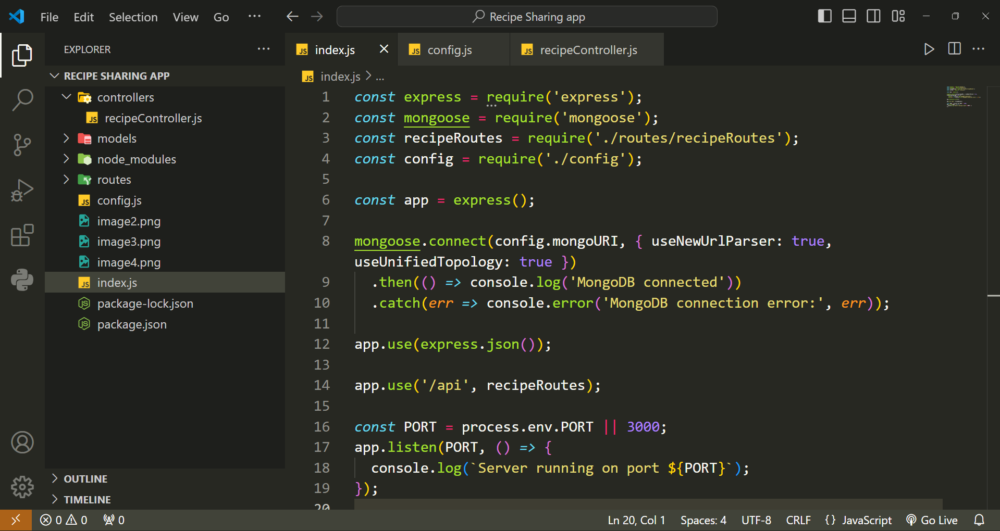
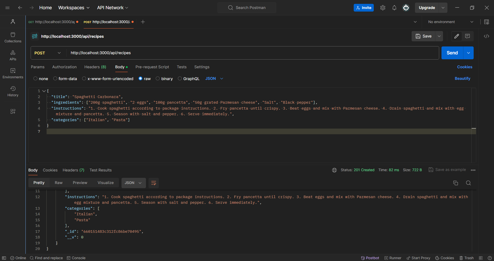
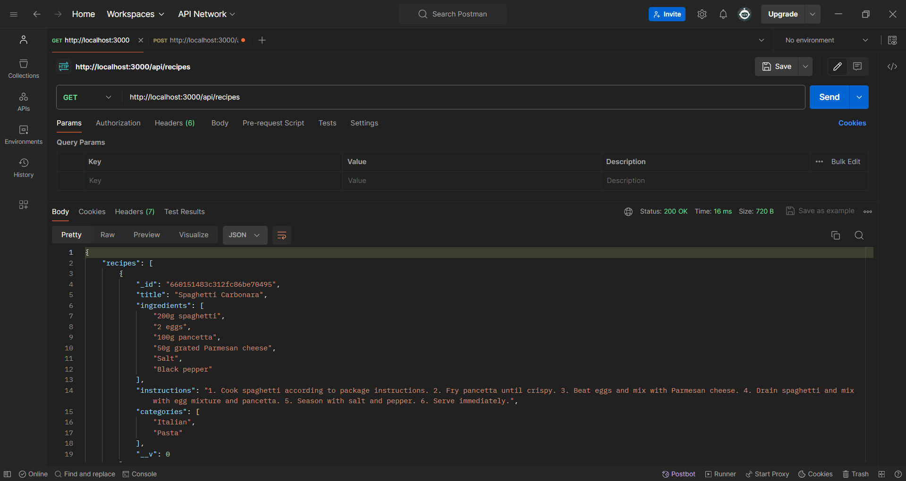
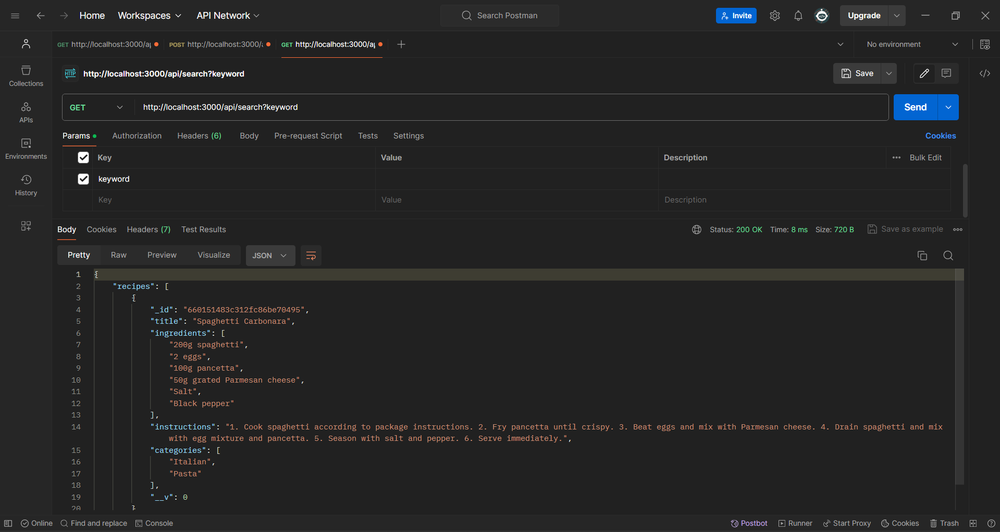

# Recipe Sharing App

Welcome to the Recipe Sharing App! This application allows users to discover, share, and manage their favorite recipes. Users can add recipes with ingredients, instructions, categories, and even include photos. They can also search for recipes by keywords or categories.

## Demo Screenshots

### Home Page



### Add Recipe Page (using Postman POST method)



### Get Recipe Page (using Postman GET method)



### Search Results Page (using Postman GET method)



## Installation and Usage

### Prerequisites

- Node.js
- MongoDB

### Installation

1. Clone the repository:

   ```bash
   git clone https://github.com/Sourav-Sir/recipe-sharing-app.git
 `

2. Navigate to the project directory:
```bash
cd recipe-sharing-app
```

3. Install dependencies:
```bash
Install dependencies:
```

4. Start the server:
```bash
npm start
```

5. Access the application in your web browser at http://localhost:3000.

